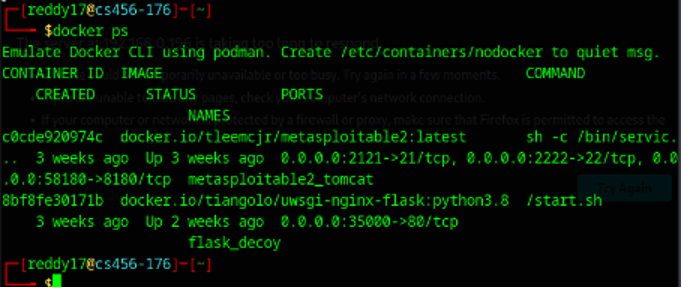
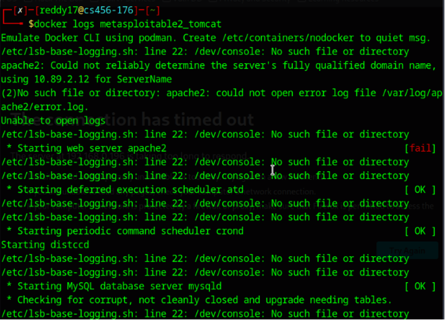
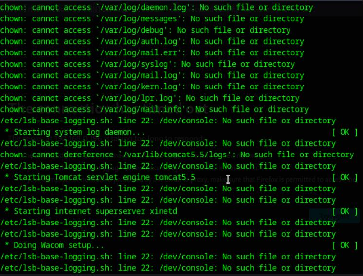
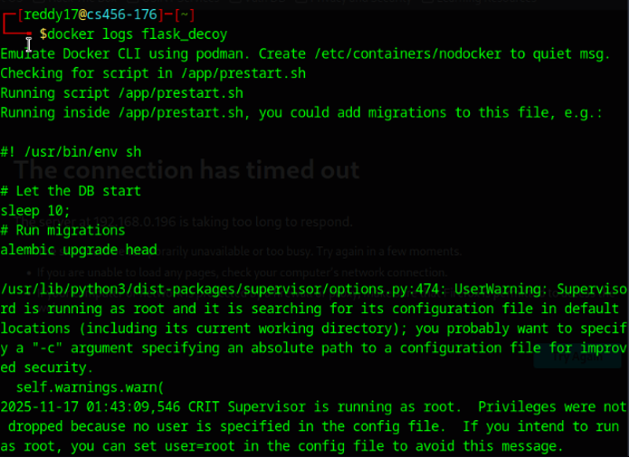
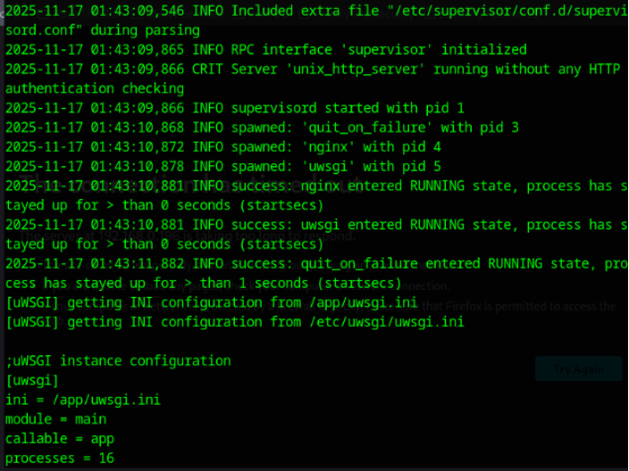
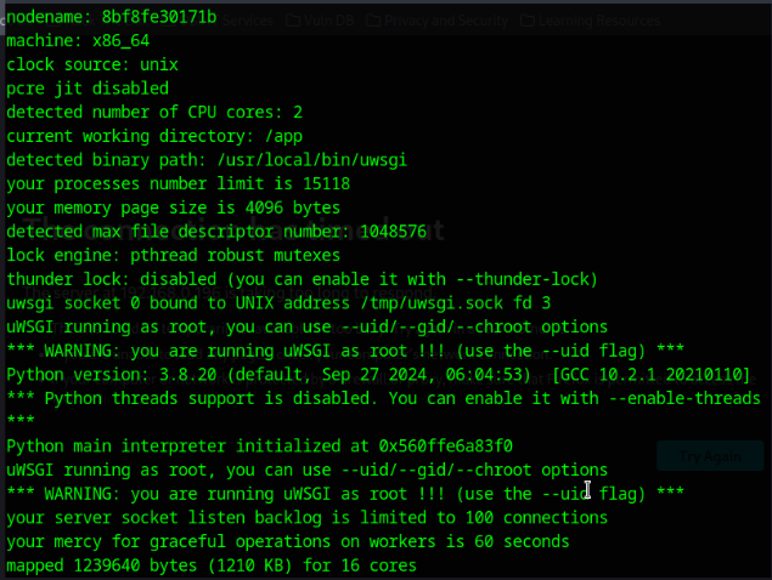

# Incident Response Report

**Incident ID:** HarshithC-12072025  
**Date of Report:** 12/07/2025  
**Report Prepared By:** Harshith Reddy Chitreddy  

---

## 1.0 Executive Summary

This report documents the investigation of a security incident detected on the containerized production network environment. On December 7, 2025, a series of unauthorized reconnaissance and exploitation attempts were identified originating from the IP address **192.168.0.176**. The attacker conducted network scanning and attempted exploitation against exposed **FTP, HTTP, and SSH services** hosted on the target system **192.168.0.196**.

Post-engagement log analysis confirmed that all attack attempts were unsuccessful, no unauthorized access was achieved, and no data exfiltration or system modification occurred. The incident was successfully contained by existing defensive controls. This report provides a detailed analysis of the attack activity, its impact, and security recommendations.

---

## 2.0 Detection and Analysis

### Initial Detection
The incident was detected during a post-engagement review of Docker container logs following the Red Team penetration testing exercise. Suspicious activity was correlated with previously observed network scanning, FTP authentication failures, and automated exploitation attempts conducted from **192.168.0.176**.

### Systems Affected

**Metasploitable2 Container**
- **Container Name:** metasploitable2_tomcat  
- **IP Address:** 192.168.0.196  
- **Function:** Vulnerable Development Server (Simulated)  

**Web Decoy Container**
- **Container Name:** flask_decoy  
- **Function:** Monitoring / Honeypot Web Service  

### Source of Attack
- **Attacker IP Address:** 192.168.0.176  
- **Attack Type:** Network reconnaissance, FTP authentication attempts, automated exploitation via Metasploit, web access attempts, and SSH authentication probing  

---

## 3.0 Timeline of Attack

| Date & Time (MST) | Attacker IP     | Description of Activity                                   | Evidence / Log Source            |
|-------------------|------------------|-----------------------------------------------------------|----------------------------------|
| Dec 7, 2025 – 15:23 | 192.168.0.176 | Network scan across multiple ports detected               | Red Team Nmap output             |
| Dec 7, 2025 – 15:26 | 192.168.0.176 | FTP anonymous login attempt failed                         | FTP service test                 |
| Dec 7, 2025 – 15:30 | 192.168.0.176 | Metasploit vsftpd 2.3.4 backdoor exploit attempted         | Metasploit console output       |
| Dec 7, 2025 – 15:32 | 192.168.0.176 | HTTP access attempt resulted in timeout                    | Browser access test             |
| Dec 7, 2025 – 15:35 | 192.168.0.176 | SSH authentication probing blocked                         | SSH service analysis            |
| Dec 7, 2025 – 16:10 | 192.168.0.176 | Post-engagement Docker log review conducted                | Docker logs output              |

---

## 4.0 Scope and Impact Assessment

### Scope
The incident was fully contained within the **Metasploitable2 container environment**. The decoy web container received no successful attack traffic beyond normal service startup activity.

### Impact

- **Data Exfiltration:** No evidence of data exfiltration was found.  
- **Data Integrity:** No files were modified, deleted, or created by the attacker.  
- **System Access:** The attacker did not achieve any level of authenticated or root access.  
- **Service Availability:** No denial-of-service condition occurred.  
- **Lateral Movement:** No lateral movement attempts were observed.  

---

## 5.0 Containment, Eradication, and Recovery

### Containment
- The Docker network remained isolated throughout the engagement.  
- No emergency shutdown was required since no breach occurred.  

### Eradication
- No malware, backdoors, or compromised accounts were found.  
- No eradication actions were required beyond preventive hardening.  

### Recovery
- Normal container operations continued without interruption.  
- No recovery actions were required since the system integrity was preserved.  

---

## 6.0 Recommendations and Lessons Learned

### Immediate Recommendations

**Restrict External FTP Exposure**  
The FTP service should be limited to internal access only or disabled if not required.  

**Investigate HTTP Service Timeout**  
The Nginx service responds at the port level but not at the application level. This should be investigated to ensure service reliability and security.  

**Harden uWSGI Execution Privileges**  
Logs show that uWSGI is running as the root user. This is a security risk and should be changed to a non-privileged service account.  

**Enable Centralized Logging**  
Forward Docker and service logs to a centralized SIEM or logging server for real-time alerting.  

**Implement Network IDS/IPS**  
Add intrusion detection tools such as Snort or Suricata for automated scanning detection.  

---

### Lessons Learned

- Patched services effectively prevented real-world exploitation.  
- Exposed network services remain attractive targets even when hardened.  
- Container-level logging must be carefully configured to capture authentication failures clearly.  
- Preventive security controls significantly reduce attacker success even in exposed environments.  

---

---

## 📸 Evidence Screenshots

### Screenshot 1

---

### Screenshot 2

---

### Screenshot 3

---

### Screenshot 4

---

### Screenshot 5

---

### Screenshot 6

---
